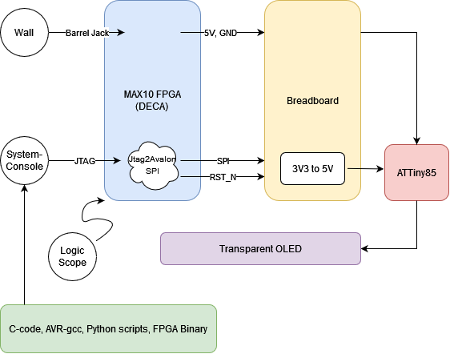
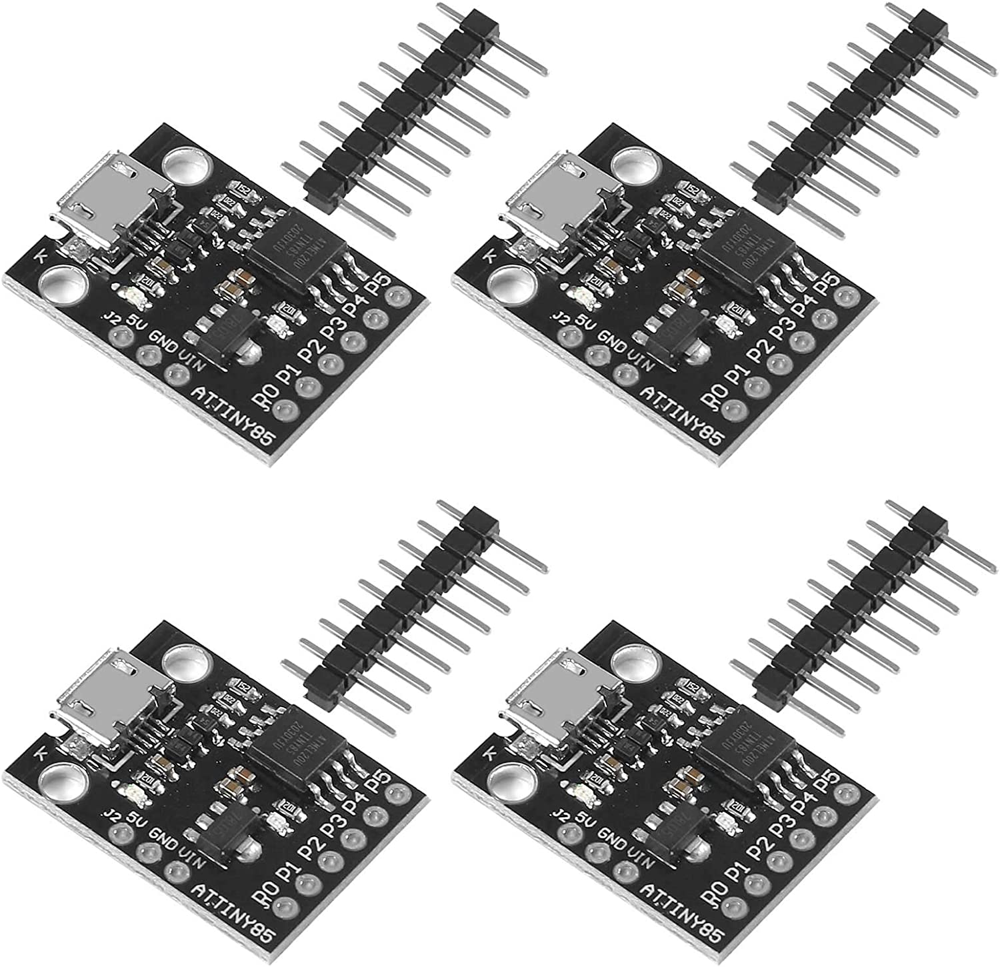

# Etsy-Ghost-OLED

Small single-weekend project to display an animated pixel-art ghost on a transparent OLED.


## Hardware

* ATTiny85
* DECA MAX10 FPGA
* NPN transistors, resistors, throw switches
* Male-male, male-female, female-female jumpers
* Digilent Analog Discovery Oscilloscope (debug only)



## Software

The final software base is under *sw/app.c*

The application is straightforward, it uses a timer interrupt to draw animation frames by sending commands and data over a bit-banged SPI bus
to the transparent OLED with SSD1309 drver. Some of the features of the SSD1309 just did not work for me, like horizontal left/right scrolling, so I had to emulate them in my software design.

Code is compiled using avr-gcc.
An objdump and objcopy are performed, followed by some hex editor maniupulation to obtain a pure hex file of the output binary.

## Programming the ATTiny

This was somewhat a PITA. In my mind I could purchase the ATTiny board, plug in a USB cable, and see
the ATTiny in the device manager / Linux filesystem. **Not!**



Instead, the easiest way to program the board I bought was over SPI, so I created a small FPGA
design to bridge the Quartus System-Console (JTAG) directly to the ATTiny.

The hex file from before was then passed through a Python script to form a series of writes within a
TCL script to the ATTiny. By holding reset low with a switch on the DECA board and running the
script in the System-Console, the ATTiny flash would get loaded with the compiled code object.
Releasing reset would then run the design.

## Bitmaps

The ghost animation was converted saved manually as monochrome bitmaps. These were then processed
into a compressed custom format so that they could be loaded directly into the ATTiny flash memory.
The C-code can then loop through the arrays and display them on the screen.

## Building

```
# create header files from bitmaps
cd oled
make

# build software
cd sw
make

# create fpga design
cd fpga
make

# load onto hardware
make prog

# open system-console
make console

# load ATTiny flash (within system-console)
source flash.tcl
```
